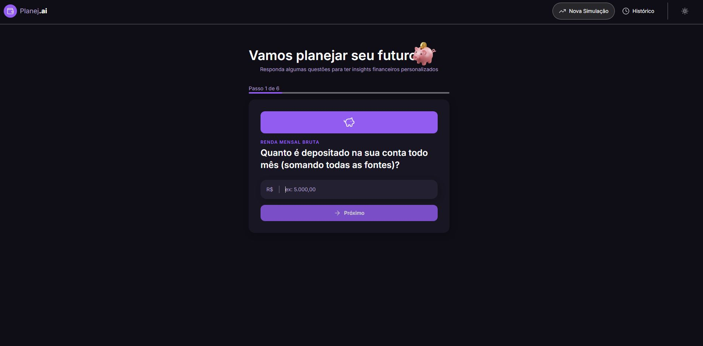
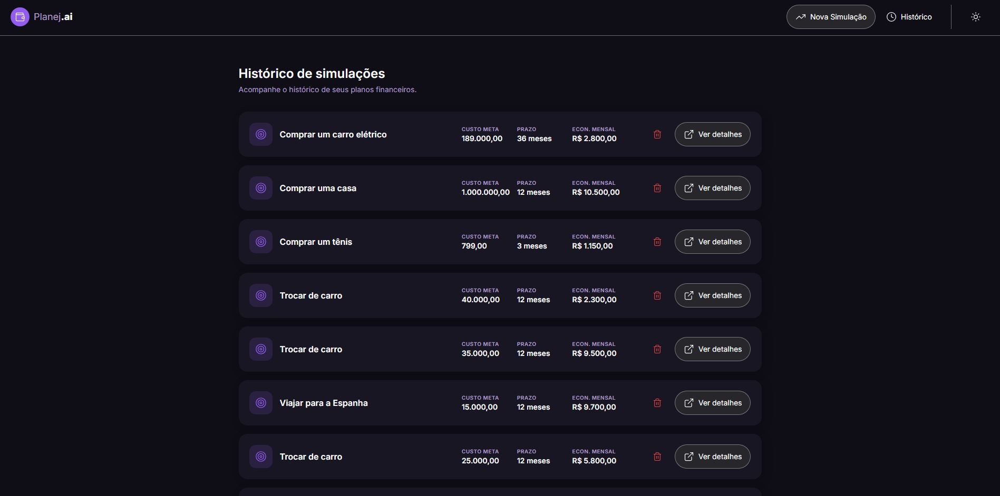
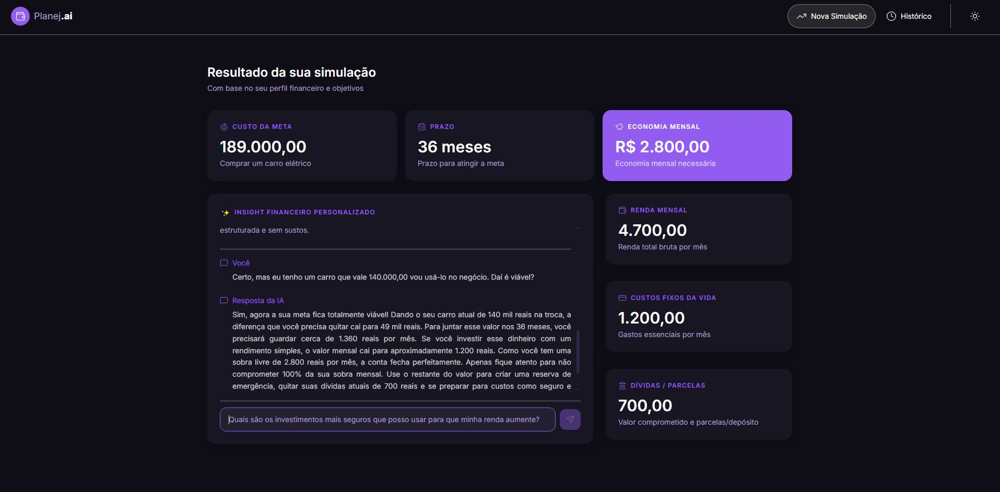
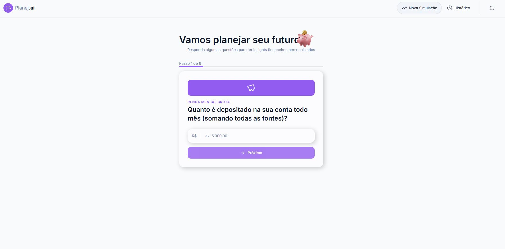

# 💰 Planej.ai — Educador Financeiro com React e IA Generativa

Projeto desenvolvido durante o **Bootcamp da [DIO](https://www.dio.me/)**, como parte da trilha de estudos em React + TypeScript com integração de Inteligência Artificial.

O **Planej.ai** é uma aplicação web de planejamento financeiro pessoal. O usuário preenche um formulário com informações sobre sua renda, gastos e uma meta financeira (como uma viagem, a troca de carro ou a compra de um imóvel), e a aplicação usa IA generativa para criar um diagnóstico personalizado, com sugestões práticas, ideias de renda extra e um plano de ação — tudo em uma conversa contínua com o usuário.

Tudo funciona diretamente no navegador: sem backend, sem banco de dados remoto. Os dados são salvos no `localStorage` e as análises são geradas em tempo real pela API do **Google Gemini**.

---

## 📸 Demonstração

**Simulação — Formulário multi-step**

Coleta de renda, gastos fixos, dívidas e a meta financeira do usuário em etapas guiadas.



**Histórico de Simulações**

Lista de todas as simulações já realizadas, com custo da meta, prazo e economia mensal necessária, permitindo revisitar ou excluir cada uma.



**Resultado da Simulação + Chat com a IA**

Diagnóstico financeiro completo gerado pela IA, com um chat integrado para que o usuário tire dúvidas adicionais sobre o próprio plano.



**Tema Claro / Escuro**

A aplicação também conta com tema claro, com troca instantânea e persistente.



---

## ✅ Funcionalidades

- Formulário multi-step para coleta de dados financeiros (renda, gastos, dívidas e meta)
- Cálculo automático de economia mensal necessária para atingir a meta no prazo
- Geração de diagnóstico financeiro personalizado via IA (Google Gemini)
- Indicação de viabilidade da meta (viável, precisa de ajuste ou inviável no prazo)
- Sugestões práticas, ideias de renda extra e recomendações de investimento
- **Histórico de simulações**, com opção de exclusão e visualização de detalhes
- **Chat contínuo com o educador financeiro (IA)**, permitindo perguntas de acompanhamento sobre a simulação, com histórico de conversa salvo
- Tema claro/escuro persistente
- Persistência de dados 100% local, via `localStorage`

---

## 🚀 Tecnologias

### Dependências de produção

| Pacote                   | Versão  | Finalidade                    |
| ------------------------ | ------- | ------------------------------ |
| `react`                  | ^19.2.7 | Biblioteca principal de UI     |
| `react-dom`              | ^19.2.7 | Renderização React no DOM      |
| `react-router-dom`       | ^7.18.1 | Roteamento client-side (SPA)   |
| `tailwindcss`            | ^4.3.3  | Framework de CSS utilitário    |
| `@tailwindcss/vite`      | ^4.3.3  | Plugin Tailwind para Vite      |
| `@fontsource/inter`      | ^5.3.0  | Fonte Inter auto-hospedada     |
| `@google/generative-ai`  | ^0.24.1 | SDK da API do Google Gemini    |
| `lucide-react`           | ^1.26.0 | Biblioteca de ícones SVG       |
| `react-loading-skeleton` | ^3.5.0  | Skeletons de carregamento      |

### Dependências de desenvolvimento

| Pacote                        | Versão  | Finalidade                               |
| ------------------------------ | ------- | ----------------------------------------- |
| `vite`                         | ^8.1.1  | Build tool e dev server                   |
| `typescript`                   | ~7.0.2  | Tipagem estática                          |
| `@vitejs/plugin-react`         | ^6.0.3  | Suporte a React no Vite (Fast Refresh)     |
| `oxlint`                       | ^1.71.0 | Linter de código                          |
| `prettier`                     | ^3.9.6  | Formatação de código                      |
| `prettier-plugin-tailwindcss`  | ^0.8.1  | Ordenação automática de classes Tailwind  |
| `@types/node`                  | ^26.1.1 | Tipos do Node.js                          |
| `@types/react`                 | ^19.2.17| Tipos do React                            |
| `@types/react-dom`             | ^19.2.3 | Tipos do React DOM                        |

---

## 📁 Estrutura de Pastas

```
planejai/
├── public/
│   ├── favicon.svg
│   └── icons.svg
├── src/
│   ├── assets/
│   │   └── images/              # Ilustrações (piggy-bank etc.)
│   ├── components/
│   │   ├── features/
│   │   │   ├── insights/        # Exibição dos insights da IA (Content, Error)
│   │   │   ├── Simulation/      # Formulário multi-step (Form, FormStep, Hero, Progress)
│   │   │   └── SimulationResults/  # Componentes da página de resultados
│   │   ├── layout/
│   │   │   └── RootLayout.tsx
│   │   └── shared/               # Componentes reutilizáveis (Button, Input, Header...)
│   ├── context/
│   │   └── theme/                # Contexto de tema (claro/escuro)
│   ├── data/
│   │   ├── aiPrompt.ts           # Montagem do prompt para o Gemini
│   │   └── simulation.ts         # Dados e configuração do formulário
│   ├── hooks/
│   │   ├── useInsight.tsx        # Chamada à API do Gemini
│   │   ├── useSimulationStorage.tsx  # Leitura/escrita no localStorage
│   │   └── useTheme.tsx
│   ├── pages/
│   │   ├── SimulationFormPage.tsx
│   │   ├── SimulationHistoryPage.tsx  # Página de histórico (Desafio 1)
│   │   └── SimulationResultsPage.tsx  # Página de resultados + chat (Desafio 2)
│   ├── services/
│   │   └── aiService.ts          # Chamada HTTP à API do Google Gemini
│   ├── styles/
│   │   └── theme.css             # Variáveis CSS de tema
│   ├── utils/
│   │   ├── currency.ts           # Máscara e formatação de moeda
│   │   └── simulation.ts
│   ├── App.tsx
│   ├── index.css
│   ├── main.tsx
│   └── router.tsx
├── index.html
├── package.json
├── tsconfig.json
└── vite.config.ts
```

---

## ⚙️ Como Executar o Projeto

1. Clone o repositório:

   ```bash
   git clone https://github.com/caires-tech/planejai.git
   cd planejai
   ```

2. Instale as dependências:

   ```bash
   pnpm install
   ```

3. Configure a variável de ambiente com sua chave da API do Google Gemini. Copie o arquivo de exemplo e preencha com sua chave:

   ```bash
   cp .env.example .env.local
   ```

   ```
   VITE_GEMINI_API_KEY=sua_chave_aqui
   ```

   > A chave pode ser obtida gratuitamente em [Google AI Studio](https://aistudio.google.com/).

4. Rode o projeto em modo de desenvolvimento:

   ```bash
   pnpm dev
   ```

5. Acesse `http://localhost:5173` no navegador.

### Outros scripts disponíveis

| Comando         | Descrição                                  |
| --------------- | ------------------------------------------- |
| `pnpm dev`      | Inicia o servidor de desenvolvimento         |
| `pnpm build`    | Gera a build de produção                     |
| `pnpm preview`  | Pré-visualiza a build de produção localmente |
| `pnpm lint`     | Executa o linter (oxlint) no projeto         |

---

## 🎯 Desafios Extras Implementados

Além do conteúdo principal do bootcamp, este projeto inclui os dois desafios propostos:

- **Desafio 1 — Página de Histórico de Simulações**: listagem de todas as simulações salvas, com resumo (custo da meta, prazo e economia mensal), navegação para os detalhes e exclusão de itens do histórico.
- **Desafio 2 — Conversando com o Educador Financeiro**: chat contínuo dentro da página de resultados, permitindo ao usuário fazer perguntas de acompanhamento sobre sua simulação, com respostas da IA, feedback de carregamento/erro, scroll automático e histórico de conversa persistido no `localStorage`.

---

## 🎨 Design

O layout do projeto foi baseado no protótipo do Figma:

[Educador Financeiro — DIO](https://www.figma.com/design/MVZhmZxoVAsgotZo50gj6M/Educador-Financeiro---DIO)

---

## 👨‍💻 Autor

Desenvolvido por **Rodrigo**, no bootcamp de React + IA Generativa da [DIO](https://www.dio.me/), como parte de sua trajetória de transição para a área de tecnologia, unindo mais de duas décadas de experiência no setor financeiro/bancário com o aprendizado prático de desenvolvimento de software.

- [LinkedIn](https://www.linkedin.com/in/rodrigo-caires/)

---

## 📄 Licença

Este projeto foi desenvolvido para fins de estudo no Bootcamp DIO. Sinta-se livre para usá-lo como referência de aprendizado.
